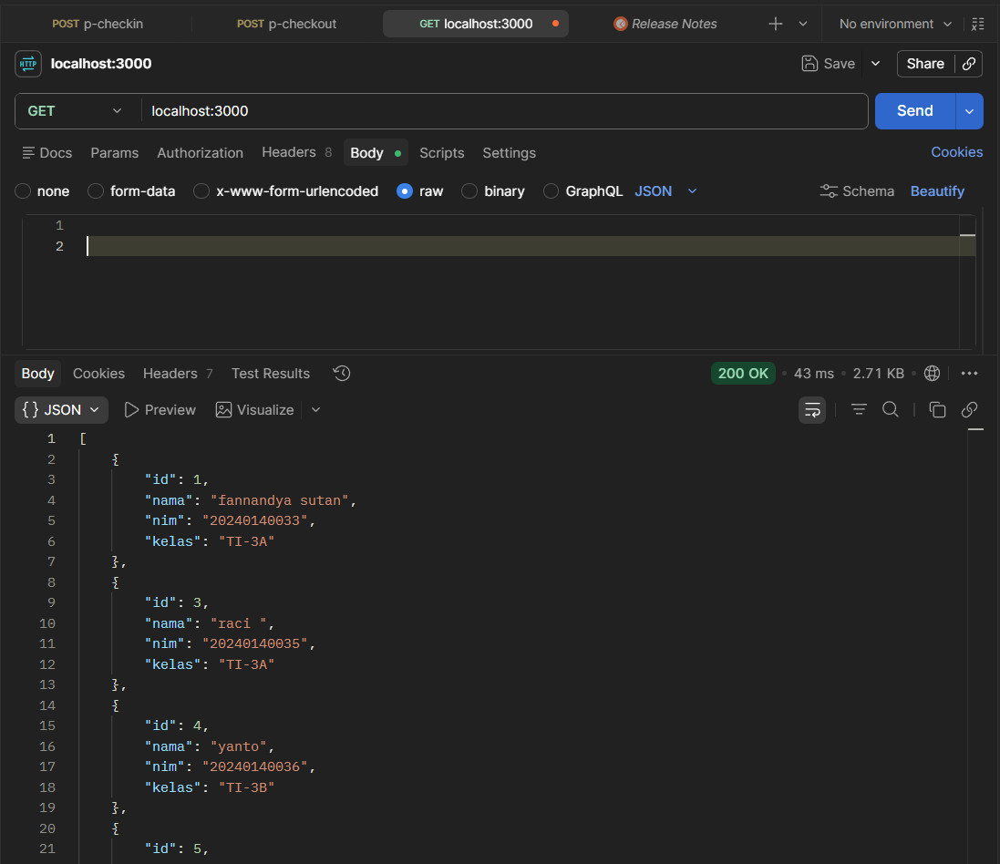
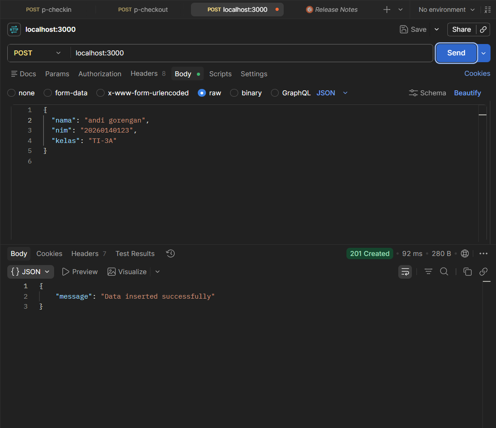
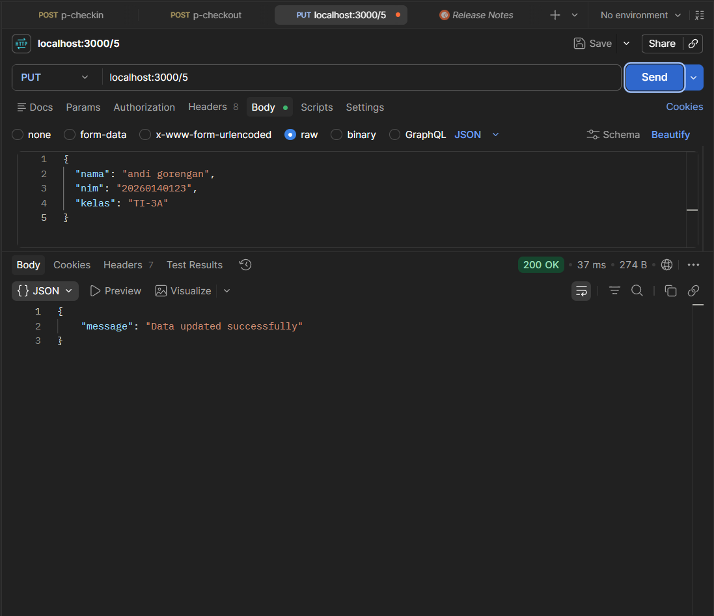
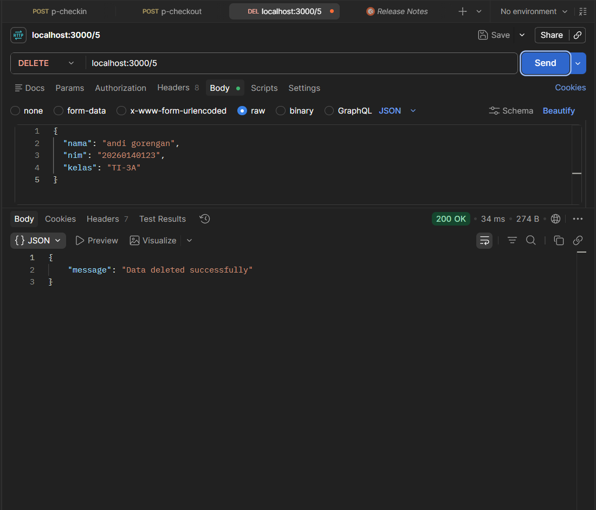

- **Nama**: Fannandya Sutan Sakti Pratama
- **NIM**: 20240140033

# CRUD API - Express + PostgreSQL

Proyek ini adalah REST API sederhana untuk CRUD data mahasiswa menggunakan **Express.js** dan **PostgreSQL**.

## Tech Stack

- **Runtime:** Node.js
- **Framework:** Express.js
- **Database:** PostgreSQL
- **Driver:** `pg` (node-postgres)

## Endpoints

| Method | Route       | Deskripsi             |
|--------|-------------|-----------------------|
| GET    | `/`         | Menampilkan semua data |
| POST   | `/`         | Menambahkan data baru  |
| PUT    | `/:id`      | Mengupdate data by ID  |
| DELETE | `/:id`      | Menghapus data by ID   |

## Screenshots (Postman)

### GET - Read All Data



### POST - Create Data



### PUT - Update Data



### DELETE - Delete Data



## Cara Menjalankan

```bash
git clone https://github.com/Fannandya/033_CRUD.git
npm install express pg
node index.js
```

Server akan berjalan di `http://localhost:3000`.
